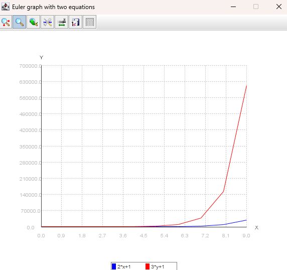

# Euler2

Este repositorio contiene un programa en Java para resolver un sistema de ecuaciones diferenciales utilizando el método
de Euler. El programa solicita la entrada del usuario para parámetros como el tamaño del paso **(h)**, condiciones
iniciales **(x1 e y1)**, y el rango de iteraciones. Luego realiza los cálculos y muestra los resultados tanto en forma
tabular como gráfica.

## Tabla de Contenidos

- [Requisitos Previos](#requisitos-previos)
- [Instalación](#instalación)
- [Formatos de Entrada](#Formato-de-entrada)
- [Ejemplo de Entrada](#Ejemplo-de-entrada)
- [Ejemplo de salida](#ejemplo-de-salida)
- [Dependencias](#dependencias)
- [Nota](#nota)

## Requisitos Previos

Antes de ejecutar la aplicación, asegúrese de tener instalados los siguientes requisitos previos:

1. [x] Java 8 o posterior
2. [x] Maven

## Instalación

Para instalar la aplicación, siga los siguientes pasos:

1. Clone el repositorio en su máquina local:

```bash
git clone https://github.com/OmerJuve2023/CalculadoraEuler2.git
```

2. Navegue a la carpeta del proyecto:

```bash
cd CalculadoraEuler2
```

3. Compile el proyecto:

```bash 
mvn clean install
```

4. Ejecute el proyecto:

```bash
java -jar target/Euler2-1.0.0.jar
```

## Formato de entrada

* **h:** Tamaño del paso para cada iteración.
* **Función A y Función B:** Expresiones matemáticas que representan el sistema de ecuaciones diferenciales.
* **x1 e y1:** Condiciones iniciales para las variables.
* **Rango inicial y rango final:** El rango de iteraciones.

## Ejemplo de entrada

```shell script
Ingrese h: 1
Ingrese Función A: 2*x+1
Ingrese Función B: 3*y+1
Ingrese x1: 1
Ingrese y1: 2
Ingrese rango Inicial: 0
Ingrese rango Final: 10
```    

## Ejemplo de salida

El programa mostrará los resultados de cada iteración tanto en forma tabular como gráfica. Además, te preguntará si
deseas continuar con otro conjunto de valores de entrada

``` shell scriptco
----------------------------
Iteration nº:1		t: 1.0
x(2)=1.0+1.0*(2*1.0+1)
x(2)= 4
y(2)=2.0+1.0*(3*2.0+1)
y(2)= 9
------------------------------------------------

Iteration nº:2		t: 2.0
x(3)=4.0+1.0*(2*4.0+1)
x(3)= 13
y(3)=9.0+1.0*(3*9.0+1)
y(3)= 37
------------------------------------------------

Iteration nº:3		t: 3.0
x(4)=13.0+1.0*(2*13.0+1)
x(4)= 40
y(4)=37.0+1.0*(3*37.0+1)
y(4)= 149
------------------------------------------------

Iteration nº:4		t: 4.0
x(5)=40.0+1.0*(2*40.0+1)
x(5)= 121
y(5)=149.0+1.0*(3*149.0+1)
y(5)= 597
------------------------------------------------

Iteration nº:5		t: 5.0
x(6)=121.0+1.0*(2*121.0+1)
x(6)= 364
y(6)=597.0+1.0*(3*597.0+1)
y(6)= 2389
------------------------------------------------

Iteration nº:6		t: 6.0
x(7)=364.0+1.0*(2*364.0+1)
x(7)= 1093
y(7)=2389.0+1.0*(3*2389.0+1)
y(7)= 9557
------------------------------------------------

Iteration nº:7		t: 7.0
x(8)=1093.0+1.0*(2*1093.0+1)
x(8)= 3280
y(8)=9557.0+1.0*(3*9557.0+1)
y(8)= 38229
------------------------------------------------

Iteration nº:8		t: 8.0
x(9)=3280.0+1.0*(2*3280.0+1)
x(9)= 9841
y(9)=38229.0+1.0*(3*38229.0+1)
y(9)= 152917
------------------------------------------------

Iteration nº:9		t: 9.0
x(10)=9841.0+1.0*(2*9841.0+1)
x(10)= 29524
y(10)=152917.0+1.0*(3*152917.0+1)
y(10)= 611669
------------------------------------------------
```

```shell script
iteración    T            X            Y
1        0.00    01.000000    02.000000
2        1.00    04.000000    09.000000
3        2.00    13.000000    37.000000
4        3.00    40.000000    149.000000
5        4.00    121.000000    597.000000
6        5.00    364.000000    2389.000000
7        6.00    1093.000000    9557.000000
8        7.00    3280.000000    38229.000000
9        8.00    9841.000000    152917.000000
10       9.00    29524.000000    611669.000000
```



## Dependencias

```xml

<dependencies>
    <dependency>
        <groupId>org.scijava</groupId>
        <artifactId>jep</artifactId>
        <version>2.4.2</version>
    </dependency>
    <dependency>
        <groupId>com.github.yannrichet</groupId>
        <artifactId>JMathPlot</artifactId>
        <version>1.0.1</version>
    </dependency>
    <dependency>
        <groupId>org.projectlombok</groupId>
        <artifactId>lombok</artifactId>
        <version>1.18.30</version>
        <scope>provided</scope>
    </dependency>
    <dependency>
        <groupId>org.junit.jupiter</groupId>
        <artifactId>junit-jupiter-api</artifactId>
        <version>5.9.3</version>
        <scope>test</scope>
    </dependency>


</dependencies>
```

## Nota

Este programa utiliza el método de Euler para aproximar soluciones a un sistema de ecuaciones diferenciales. La
precisión de los resultados depende del tamaño del paso (h). Ajusta el tamaño del paso en función de las características
específicas del sistema que estás modelando.